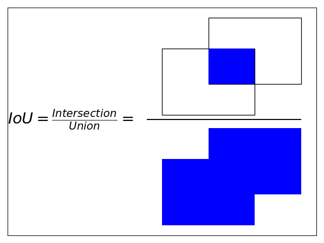

# 混同行列

<table>
<tr>
<td rowspan="2" colspan="2">調和平均（F値）で<br>注目したいのはTP↘</td>
<td colspan="2">予測値</td>
</tr>
<tr>
<td>Posi</td>
<td>Nega</td>
</tr>
<tr>
<td rowspan="2">正解値</td>
<td>Pos</td>
<td bgcolor="blue" style="color:white">TP</td>
<td>FN</td>
</tr>
<tr>
<td>Nega</td>
<td>FP</td>
<td bgcolor="blue" style="color:white">TN</td>
</tr>
</table>

<ins>※ 二文字目のP・Nは、予測値をさす。</ins>

**適合率（Precision）**

$\displaystyle=\frac{TP}{TP+FP}$ ・・・<ins>分母は **縦方向**。</ins>

**再現率（Recall）**

$\displaystyle=\frac{TP}{TP+FN}$ ・・・<ins>分母は **横方向**。</ins>

**F値（F-score）**

$\displaystyle=2\times\frac{Precision\times{Recall}}{Precision+Recall}$

$\displaystyle=\frac{1}{\displaystyle\frac{1}{Precision}+\frac{1}{Recall}}\times 2$

適合率と再現率はトレードオフの関係にあるので、この二つの指標の調和平均を算出し、F値という評価指標とする。

～　調和平均の解説　～

調和平均は **『比率率の平均』** である。分子／分母で構成された指標に対して、その分子を基準とする場合の平均と言える。

通常の平均の算出式と比べると逆のイメージで捉えるとよい（２で割るのではなく2を掛ける、逆数の足し算が分子ではなく分母に来ている、など）。<ins>F-Score は分子、この場合 TP に着目した指標と理解しておく。</ins>

例）時速は、距離/時間（km/h）の比率の指標である。この場合、調和和平均は距離を基準とした比率の平均となる。

# IoU (Intersection over Union)



# 物体検出の場合

複数ラベルの検出でも、1種類のラベル毎に考える。  
例）正解ラベル：Dog（正解BBox数5）

|Rank|Confidence|IoU≧Thres?|Precision|Recall|
|:---:| ---: | ---: | ---: | ---: |
| 1 | 95| TP |1/1|1/5|
| 2 | 90| TP |2/2|2/5|
| 3 | 85| FP |2/3|2/5|
| 4 | 80| TP |3/4|3/5|
| 5 | 75| FP |3/5|3/5|
| 6 | 70| TP |4/6|4/5|
| 7 | 65| TP |5/7|5/5|
| 8 | 60| FP |5/8|5/5|
| 9 | 55| FP |5/9|5/5|
|10 | 50| FP |5/10|5/5|


検出BBoxリストを信頼度でソートする。

`IoU ≧ Threshold` のみをTrue、それ以外をFalseとする。

⇒ TP, FP

※ 混同行列の TN は定義しない（できない）

<table>
<tr>
<td rowspan="2" colspan="2">物体検出の場合</td>
<td colspan="2">予測BBox</td>
</tr>
<tr>
<td>Posi</td>
<td>Nega</td>
</tr>
<tr>
<td rowspan="2">正解BBox</td>
<td>Pos</td>
<td bgcolor="blue" style="color:white">TP</td>
<td>FN</td>
</tr>
<tr>
<td>Nega</td>
<td>FP</td>
<td>TN(未定義)</td>
</tr>
</table>

検出BBoxリストの行ごとのPrecisionとRecallを算出する。

$Precision=\displaystyle\frac{現在Rank以上にあるTPの数}{現在Rank以上にあるBBox数}$

※ 分母は+1づづ加算される。

$Recall=\displaystyle\frac{現在Rank以上にあるTPの数}{正解BBoxの数}$

※ 分母は一定。

`Recallが1以上になる場合`

## AP( Average Precision ), mAP( Mean AP )

PR曲線（Precision-Recall Curve）


APは理論的にはPR曲線の積分値である。

$AP=\displaystyle\int^1_0p(r)dr$

しかし、実際は、ジグザクを長方形型へと補完した補正値を用いて算出する。

$\displaystyle P_{interpolated}(r)=\max_{\tilde{r}\ge r}{p(\tilde{r})}$

Pythonで実装する場合
```python
tp = [True if i>thres else False for i in iou]
fp = [not i for i in tp]
tp_cumsum = np.cumsum(tp) #TP累積和
fp_cumsum = np.cumsum([not i for i in tp]) #FP累積和
precision = tp_cumsum/(tp_cumsum + fp_cumsum)
recall = tp_cumsum/sum(x==True for x in tp)

recall0_1 = np.concatenate([[0], recall, [1]])
precision0_1 = np.concatenate([[0], precision, [0]])

#リストを逆順にして、
reversed_precision = precision0_1[::-1]
#補正値を算出して、
accumulated_precision = np.maximum.accumulate(reversed_precision)
#順序を戻す
interpolated_precision = accumulated_precision[::-1]
```

$AP=\displaystyle\sum^N_{i=2}(r_i-r_{i-1})P(r_i)$

クラス数がCのときのmAP。

$mAP=\displaystyle\frac{1}{C}\sum^C_{i=1}AP_i$
