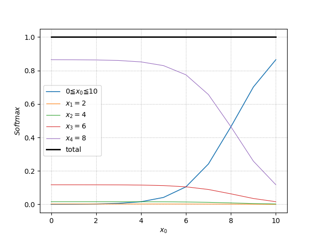

# Softmax

$\displaystyle y_i=\frac{e^{x_i}}{\displaystyle \sum^n_{k=1}e^{x_k}}$

$(i=1,2,...,n)$

# ReLU

derivative

$f'(x)=\begin{cases}
   0 &x<0 \\
   \text{不可能} & x=0 \\
   1 &x>0
\end{cases}$

## Leaky ReLU

derivative

$f'(x)=\begin{cases}
   \alpha &x<0 \\
   \text{不可能} & x=0 \\
   1 &x>0
\end{cases}$

# Sigmoid

$\displaystyle f(x)=\frac{1}{1+e^{-ax}}\quad(a>0)$

derivative

$f(x)'=af(x)(1-f(x))$
