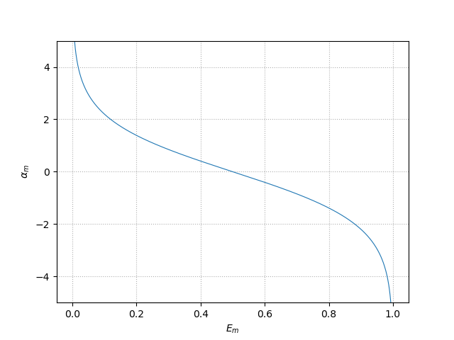

# AdaBoost（アダ・ブースト）

学習データに変化（重み付け）を与える。

① 最初のモデルの重みを $w^{1}_i=\frac{1}{N}$ に設定（ $N$ : 標本数）

② $m=1,...,M$ （モデル数）で、以下を繰り返す

②-1 モデル $m$ の誤差と信頼度の算出

誤差：

$\displaystyle E_m=\frac{\sum_i^N w_i^m I(y_m(x_i)\ne{t_i})}{\sum_i^N w_i^m}$

$I$ : 予測が正解の場合 0、不正解の場合 1 を戻す（0か1を返す関数）。

データ $i$ が不正解の場合、 $I\to 1$ が加重加算されるので、$E$ は大きくなる。

※ $E$ が減少するように 分岐 $y_m$ を決めていく。

信頼度：

$\displaystyle \alpha_m=\log(\frac{1-E_m}{E_m})$

※ $\frac{1}{E_m}-1$ : $0\lt E_m\lt 1$

※ $E_m= 0$ の時 $\alpha_m=\infty$ とする。

②-2 重み更新

$w^{m+1}_i=w^m_i\exp{\alpha_m I(y_m(x_i)\ne{t_i})}$

正解の $i$ では $\exp{(\alpha_m\times{0})}=1$ となり更新されない。不正解の $i$ に対してのみ更新される。

④ 完成するモデル

$H(x)=\displaystyle sgn(\sum^M_{m=1}\alpha_my_m(x))$

※ 0か1を戻す。
