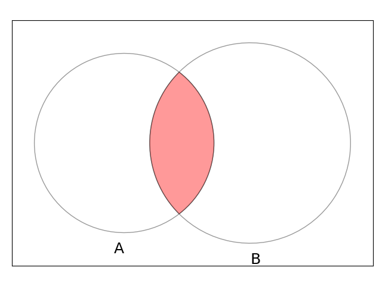

# ベイズの定理（Bayes' theorem）

$\displaystyle P(A|B)=\frac{P(B|A)P(A)}{P(B)}$

～　解説　～

条件付き確率の次式は<ins>ベン図で理解すると良い。</ins>

$\displaystyle P(B|A)=\frac{P(A\cap B)}{P(A)}$

⇒ $P(A\cap B)=P(B|A)P(A)$

次式も同様に成り立つことが分かる。

$\displaystyle P(A|B)=\frac{P(A\cap B)}{P(B)}$

上の式の $P(A\cap B)$ を下の式に代入する。⇒『ベイズの定理』

# 原因と結果（順行と逆行）

ベイズの定理の右辺にある $P(B|A)$ を $\text{B when A}$ と言われるとおり、

$B:\text{結果}\gets A:\text{原因}$

という**時間順行の確率**と理解できる。その理解をそのまま左辺の $P(A|B)$ に適用すると、

$A:\text{原因}\gets B:\text{結果}$

という**時間逆行の確率**になっている。

ポイント：ベイズの定理を用いることで、順方向の確率から逆方向の確率を導くことができる。このことから、<ins>ベイズ推定は『結果から原因を探る確率』と理解することができる。</ins>
