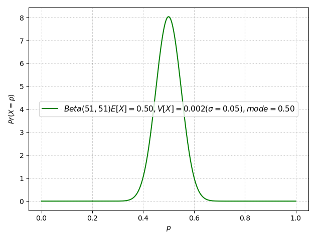

# ベイズの定理（Bayes' theorem）

$\displaystyle P(A|B)=\frac{P(B|A)P(A)}{P(B)}$

※ 定理に $A\cap B$ は使われていない。

～　解説　～

条件付き確率の次式は<ins>ベン図で理解すると良い。</ins>

$\displaystyle P(B|A)=\frac{P(A\cap B)}{P(A)}$

⇒ $P(A\cap B)=P(B|A)P(A)$

次式も同様に成り立つことが分かる。

$\displaystyle P(A|B)=\frac{P(A\cap B)}{P(B)}$

上の式の $P(A\cap B)$ を下の式に代入する。⇒『ベイズの定理』

# 原因と結果（順行と逆行）

ベイズの定理の右辺にある $P(B|A)$ を $\text{B when A}$ と言うとおり、

$B:\text{結果}\gets A:\text{原因}$

という**時間順行の確率**と理解できる。その理解をそのまま左辺の $P(A|B)$ に適用すると、

$A:\text{原因}\gets B:\text{結果}$

という**時間逆行の確率**になっている。

ポイント：ベイズの定理を用いることで、順方向の確率から逆方向の確率を導くことができる。このことから、<ins>ベイズ推定は『結果から原因を探る確率』と理解することができる。</ins>　定理の右辺 $P(B|A)P(A)/P(B)$ のいづれの確率も普通の思考（時間順行）で算出できる。

# 最尤推定の問題

「サイコロを n 回振って出た目と出た回数が記録されている。そのデータから、1 ～ 6 の各々の出る目の確率を推定する」問題を多項分布とした最尤推定法で解くと以下のような式となる。この式からも明かなように、回数 n が少ない場合、この値は信頼できない確率となってしまう。例えば、n=6では、1/6 からかけ離れた 0などの $\hat{p_i}$ が算出されてしまう。

$\displaystyle\hat{p}_i=\frac{k_i}{n}$

～＞　ベイズ推定を使って解決

# 事前分布（ $P^{pre}(p)$ ）

ある事象が発生する確率が $p$ である確率密度を事前分布と呼び、 $P^{pre}(p)$ で表す。

# ベイズ推定

① **事前分布**（ $\displaystyle P^{pre}(p)$ ）を選択する

② 事前分布と事実（データ）を融合して **事後分布**（ $\displaystyle P^{post}(p)$ ）を導出する

③ $\displaystyle\arg\max P^{post}(p)$ を計算する。すなわち $\displaystyle P^{post}(p)$ が最大化するときの $\displaystyle\hat{P}_{MAP}$ を算出する（⇒ **ベイズ推定** ）。

～　コイントスの例　～

例１） 3回投げたら2回表が出た。  例２） 100回投げたら60回表が出た。

<ins>そもそも、おおよそ0.5近辺と想像できる表率 $p$ はどのような分布に従うこととするか？を決める</ins>

今回は、平均1/2、標準偏差5%の **ベータ分布を事前分布** に従うとする。

$\alpha=51, \beta=51$

$\displaystyle P^{pre}(p)=Beta(51,51)=\frac{p^{\alpha-1}(1-p)^{\beta-1}}{B(\alpha,\beta)}=C1\times p^{50}(1-p)^{50}$

表率 : $p\backsim Beta(51,51)$

例１）

表率 $p$ かつ 3回投げたら2回表となる事後分布（ $\displaystyle P^{post}(p)$ ）を導出し 、これを最大化する $\displaystyle\hat{P}_{MAP}$ を算出する。

$\displaystyle P^{post}(p)=C1\times p^{50}(1-p)^{50}\times C2\times p^2(1-p)^1$

$=C3\times p^{52}(1-p)^{51}$

$\displaystyle \hat{P}_{MAP}=\arg\max P^{post}(p)$

両辺の対数を取る。

$\displaystyle\log P^{post}(p)=C3\times(52\log{p}+51\log(1-p))$

()内が最大となるpを求める。()をpで微分して=0とおく。

$\frac{52}{p}-\frac{51}{1-p}=0$

$52=(52+51)p$

$\hat{p}=52/(52+51)=0.5049$

例２）

表率 $p$ かつ 100回投げたら60回表となる事後分布を導出し 、これを最大化する $p$ を算出する。

$\displaystyle P^{post}(p)=C1\times p^{50}(1-p)^{50}\times C2\times p^{60}(1-p)^{40}$

$=C3\times p^{110}(1-p)^{90}$

$\displaystyle \hat{P}_{MAP}=\arg\max P^{post}(p)$

両辺の対数を取る。

$\displaystyle\log P^{post}(p)=C3\times(110\log{p}+90\log(1-p))$

()内が最大となるpを求める。()をpで微分して=0とおく。

$\frac{110}{p}-\frac{90}{1-p}=0$

$90p=110-110p$

$\hat{p}=110/(110+90)=0.55$

～　最尤推定値 $\Big(\displaystyle\hat{p}_i=\frac{k_i}{n}\Big)$ との比較　～

||最尤推定|ベイズ推定|
| :--- | ---: | ---: |
| 例１ | 0.67 | 0.50 |
| 例２ | 0.60 | 0.55 |

# 参考

AIcia Solid Project
- [ベイズ統計](https://www.youtube.com/playlist?list=PLhDAH9aTfnxIU4Hd1G1UdIVzHpgKfyEnw)

予備校のノリで学ぶ「大学の数学・物理」
- [【大学数学】ベイズの定理【確率統計】](https://youtu.be/oUN_GhB00fU)
