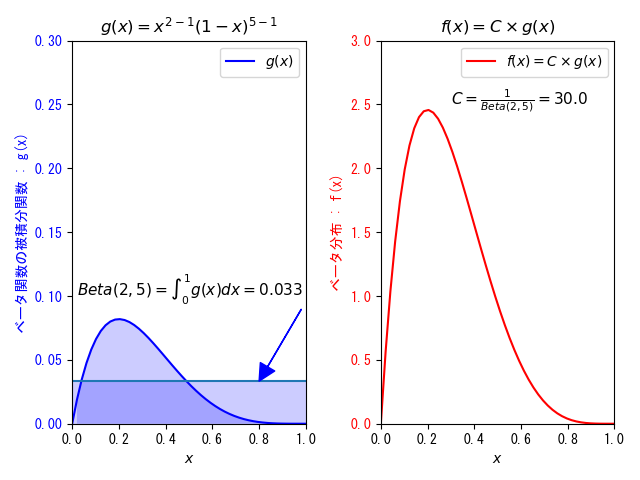
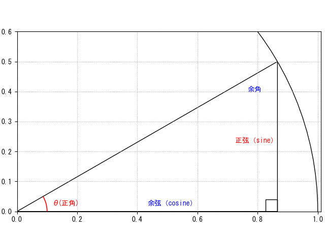
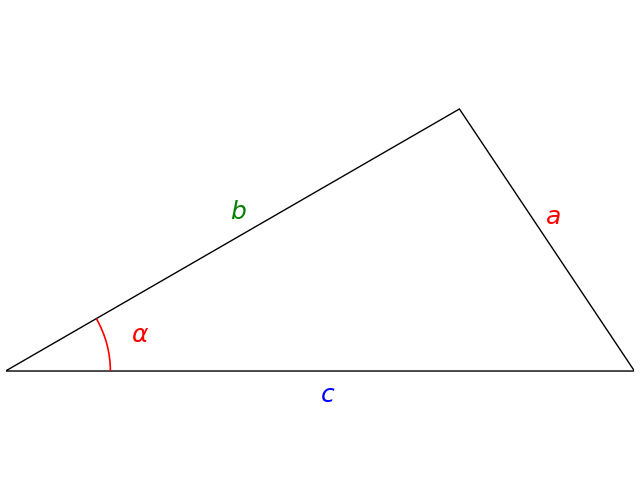
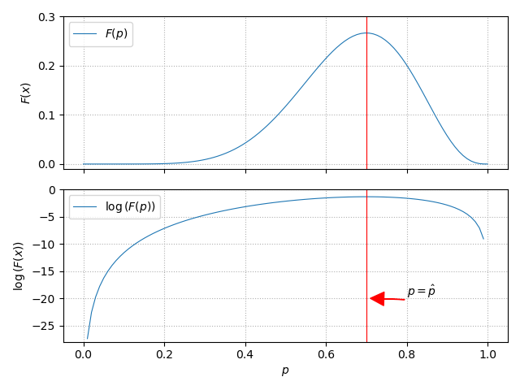

※上へ追記していく

# 不定積分と定積分

微分すると被積分関数 $f(x)$ になる関数のことを不定積分という。不定積分に積分区間の両端の値を代入した値の差のことを定積分という。不定積分は関数であり，定積分は値になる。

例）

$\displaystyle\int f(x)dx=\int2xdx=x^2+c$

※定数Cは不定（微分で消える）

$\qquad\qquad\space\space 2x\xrightarrow[]{積分}$ ［不定積分］  
［被積分関数］ $\xleftarrow[微分]{}\quad x^2+c$  

# ベータ関数

～　定義　～

$\displaystyle Beta(p,q)=\int^1_0x^{p-1}(1-x)^{q-1}dx$

## ベータ分布との関係

# 共分散（Covariance ）

大きさが同じ二つのデータ間での、平均からの偏差の積の平均値である。$(x_i,y_i)$ の散布データが $n$ 組ある。

$\displaystyle\sigma_{xy}=\frac{1}{n}\sum^n_{k=1}(x_k-\overline{x})(y_k-\overline{y})$

別の表記方法：

確率変数X,Yが複数組みあるとき、

$\text{Cov}[X,Y]=E[(X-E[X])(Y-E[Y])]$

$E[X]$ : Xの期待値・平均値

※ 外側の期待値 $E[]$ は、確率を掛けることと同じ。

# 集合記号

## ∈（属する）

$x\in\lbrace 0,1\rbrace$ : $\lbrace\rbrace$ の中の値のどれか一つ。

※ $\lbrace\rbrace$ は集合を表す。

$x\in[0,1]$ : この区間・範囲の値のどれか一つ。

# 確率密度

連続型の確率分布の縦軸は **『確率密度』** である（『確率』ではない）。二項分布、ポアソン分布などの離散型の確率分布では確率でも間違いではない。

# $e^x$ のマクローリン展開

$e^x=\displaystyle\frac{x^0}{0!}+\frac{x^1}{1!}+\frac{x^2}{2!}+\frac{x^3}{3!}+...$

$=\displaystyle\sum^{\infty}_{k=0}\frac{x^k}{k!}$

# 0!（0の階乗）の定義

$0!=1$

～　都合が良い（場合分けが不要）例　～

組合せの計算式が $k=n$ でも成り立つ。

${}_nC_k=\displaystyle \frac{n!}{k!(n-k)!}=\frac{2!}{2!(0!)}=1$

# ベクトルの内積（Inner product of vectors）
**～　n次元数ベクトルの内積（成分）　～**

$\vec{u}=(u_1,u_2,...,u_n)$ , $\vec{v}=(v_1,v_2,...,v_n)$

$\displaystyle \vec{u}\cdot\vec{v}=\sum^n_{i=1}u_iv_i$

～　２次元ベクトルの内積 ～

$\vec{a}\cdot\vec{b}=\|a\|\|b\|\cos\theta$

～　２次元ベクトルの内積（成分）～

$\vec{a}=(a_1,a_2)$ , $\vec{b}=(b_1,b_2)$

$\vec{a}\cdot\vec{b}=a_1\times{b_1}+a_2\times{b_2}$

---  
【証明】  
余弦定理 ： $C^2=A^2+B^2-2AB\cos\theta$  
$(a_1-b_1)^2+(a_2-b_2)^2=(a^2_1+a^2_2)+(b^2_1+b^2_2)-2AB\cos\theta$  
$a^2_1-2a_1b_1+b^2_1+a^2_2-2a_2b_2+b^2_2=(a^2_1+a^2_2)+(b^2_1+b^2_2)-2AB\cos\theta$  
$-2a_1b_1-2a_2b_2=-2AB\cos\theta$  
$a_1\times{b_1}+a_2\times{b_2}=\|a\|\|b\|\cos\theta$

---

# 正弦と余弦

## 余弦定理（Law of cosines）

$a^2=b^2+c^2-2bc\cos\alpha$

※ 左辺（ $a^2$ ）は、正角 $\alpha$ の正弦 $a$ の二乗であるが、コサインが登場するので余弦定理。

# 順列と組み合わせ

## ${}_nP_k$ （Permutation：順列）

異なる $n$ 個のものの中から $k$ 個取り出して並べる順列の総数。

${}_nP_k=n(n-1)(n-2)...(n-k+1)$

$=\displaystyle\frac{n!}{(n-k)!}$

<ins>※ n から k 回、 前の値-1 した値を掛ける。</ins>

## ${}_nC_k$ （Combination：組み合わせ）

異なる $n$ 個のものの中から $k$ 個取り出すときの組み合わせの総数。

$\displaystyle {}_nC_k=\frac{{}_nP_k}{k!}$

$=\displaystyle\frac{n!}{k!(n-k)!}$

<ins>※ n から k 回、 前の値-1 した値を掛ける。それをk!で割る（分母）。</ins>

※『 ${}_nP_k$ と同じ手順で算出したものに対し、 $k!$ で割る』と覚える。

# 対数を利用する理由

関数 $F(p)$ が $(0\leqq p\leqq1)$ （例えば確率など）の範囲で最大となる $p=\hat{p}$ を求めたい。 $F(p)$ が $\nearrow\searrow$ 型であれば、 $F(p)$ の頂点、すなわち傾きが 0、微分 $F'(p)=0$ となる地点を求めれば良い。

一方、 対数の性質から対数関数 $L(p)=\log{(F(p))}$ も同様の極大点で $\nearrow\searrow$ 型を形成し $L(p)$ は、 $F(p)$ と同じく $p=\hat{p}$ で最大となる。

この性質を利用し、 $\hat{p}$ を求める際、微分のし易さから $F'(p)$ ではなく $L'(p)$ を使う場合がある。

# 対数の性質

～　積の対数　～

$\log{MN}=\log{M}+\log{N}$

～　商の対数　～

$\displaystyle \log\frac{M}{N}=\log{M}-\log{N}$

～　累乗の対数　～

$\log{M}^n=n\log{M}$

※ $=\log({M_1\times{M_2}...\times{M_n}})$

# 符号関数 $sgn(x)$

$sgn(x)$ は符号関数と呼ばれ、引数が0より小さければ-1を、0より大きければ1を返す。サイン関数と紛らわしいので、**シグナム関数** （signum function）と呼ぶことがある。

# 確率の表し方

**条件付き確率：**

$P(事象|条件)$

$P(A|B)\quad\text{Probability of A given B}(\text{A when B})$

事象Bが起こったときに事象Aが起こる確率。 

## 捕捉

事象Aと事象Bが独立であるとき、AとBが同時に起きる確率は、

$P(A\cap B)=P(A)\times P(B)$

事象Aと事象Bが独立でないとき、...

$P(A\cap B)=P(A|B)\times P(B)$

$\displaystyle P(A|B)=\frac{P(A\cap B)}{P(B)}$ ： 条件付き確率

# 点と直線の距離の公式

$ax+by+c=0$ と $(x_1,y_1)$ の距離

$\displaystyle  d=\frac{|ax_1+by_1+c|}{\sqrt{a^2+b^2}}$

⇒ SVMの数学で類似の式（多次元版）が登場する

# 連鎖律

２段の合成関数

$f=f(u),u=u(x)\to f(u(x))$

$f$ は $u$ から定まり、 $u$ は $x$ から定まる。この時、

$\displaystyle \frac{df}{dx}=\frac{df}{du}\frac{du}{dx}$

<ins>３段以上の場合も同様</ins>

$f=f(u),u=u(v),v=v(x)\to f(u(v(x)))$

$f$ は $u$ から定まり、 $u$ は $v$ から定まり、 $v$ は $x$ から定まる。。この時、

$\displaystyle \frac{df}{dx}=\frac{df}{du}\frac{du}{dx}$
$\displaystyle=\frac{df}{dv}\frac{dv}{dx}$
$\displaystyle=\frac{df}{du}\frac{du}{dv}\frac{dv}{dx}$

（例）

$f=2u,u=3v,v=4x\to f=2(3v)\to 2(3(4x))=24x$

$\displaystyle \frac{df}{du}\frac{du}{dx}=\frac{df}{du}(\frac{du}{dv}\frac{dv}{dx})$
$=2\times{(3\times{4})}=24$

$\displaystyle \frac{df}{dv}\frac{dv}{dx}=(\frac{df}{du}\frac{du}{dv})\frac{dv}{dx}$
$=(2\times{3})\times{4}=24$

<ins>NNの最終層の勾配計算に引き寄せて考えてみる</ins>

$u$ : 重み付け線形和 $\varphi$ : 活性化関数 $E$ : 誤差関数

$E(\varphi(u(w)))$ の $w$ による微分：

$\displaystyle\frac{dE}{dw}=\frac{dE}{d\varphi}\frac{d\varphi}{du}\frac{du}{dw}$

## 多変数関数の連鎖律

$f(u,v),u=u(x,y),v=v(x,y)$
$\to f(u(x,y),v(x,y))$

$\displaystyle \frac{\partial f}{\partial x}=\frac{ \partial f}{\partial u}\frac{\partial u}{\partial x}+\frac{ \partial f}{\partial v}\frac{\partial v}{\partial x}$

一般化：

$\displaystyle \frac{\partial f}{\partial x}=\sum_k\frac{ \partial f}{\partial u_k}\frac{\partial u_k}{\partial x}$

# $B(n,p)$ と $N(\mu,\sigma)$

※ （）内の記号の意味が異なる。

$B(n,p)$ :  二項分布

成功確率 $p$ (失敗確率 $q=(1-p)$ )のベルヌーイ試行を $n$ 回試行したとき、 成功回数が従う分布。

# 多変量正規分布
1次元の正規分布を高次元へと一般化した確率分布。多次元正規分布ともいう。VAE(Variational AutoEncoder)で利用。

$潜在変数z\backsim N(\mu,\sigma)$

$\mu$ : 平均値≒期待値  
$\sigma$ : 標準偏差

# 正規分布

$N(\mu,\sigma)$ : 期待値 $\mu$ と標準偏差 $\sigma$ に従う分布からサンプリングすることを表す。口頭では、期待値を平均値、標準偏差を分散( $\sigma^2$ )と表現することがある。

確率密度関数：

$f(x)=\displaystyle\frac{1}{\sqrt{2\pi}\space\sigma}e^{-\frac{(x-\mu)^2}{2\sigma^2}}$

$\mu\pm\sigma$ に変曲点が来る。

$E[X]=\mu$  
$V[X]=\sigma^2$

# 重み付け線形和

入力層に２つ、１層目に２つのニューロンを想定する。  
このとき１層目の１つめのニューロンへの入力と２つ目のニューロンへの入力は、  

１つ目

$u^1_1 = w_{11}\times x_1 + w_{21}\times x_2$

２つ目

$u^1_2 = w_{12}\times x_1 + w_{22}\times x_2$

**一般化**

$u^l_j = w^l_{1j}z_1^{l-1}+w^l_{2j}z_2^{l-1}+..$

$^l$ : layer  
$w_{ij}$ : i 番目ニューロンから j 番目ニューロンへの重み

# 三角関数の微分公式

$(sinx)' = cosx$

$(cosx)' = -sinx$

$(tanx)' = -\frac{1}{cos^2x}$

# 平方根 $\sqrt{x}$ の微分

$y=\sqrt{x}=x^{1/2}$

$y'=\frac{1}{2}x^{-1/2}=\frac{1}{2\sqrt{x}}$

# 指数関数 $a^x$ の微分

$a>0,\space a\ne1$

$(a^x)'=a^x\log_{e}a$

$a=e$ の場合：

$(e^x)'=e^x$

$(e^{nx})'=(e^{nx})\times{n}=ne^{nx}$　・・・合成関数の微分

# 対数 $\log_a{x}$ 関数の微分

$\displaystyle (\log_a{x})'=\frac{1}{x\log{a}}$

$a=e$ の場合：

$\displaystyle (\log{x})'=\frac{1}{x}$

# 指数関数と対数関数のグラフ

$y=x$ に対して対称となる。

# 偏差値
**※「標準偏差値」という用語は無い。**

$偏差値=\frac{x-\mu}{\sigma}\times 10 + 50$

平均との差に対して、分散（ばらつき）が小さいほど影響を大きく（ずば抜けて...）、分散が大きいほど影響を小さくしたいので、分散が分母にくる。

$\sigma$ : 標準偏差（standard deviation）= $\sqrt{分散}$

$\sigma^2$ : 分散（variance）

# 確率変数（Stochastic Variable）
具体的な値のこと。確率変数を $X$、実現値を $x$ で表す。

確率(密度)関数とは「具体的な値から確率を得る関数 $f(X)$」のこと。  
e.g.)正規分布、一様分布

# 期待値
確率変数が取る値を、確率によって重み付けした**加重平均値**。期待値の定義は離散型確率変数と連続型確率変数とで扱いが異なる。

離散型  
$E[X]=\sum_i{x_if(x_i)}$

連続型  
$E[X]=\int^{\infty}_{-\infty}{xf(x)dx}$

# 平均値と期待値の関係
平均値は次の式で求められる。

$\displaystyle\overline{x}=\sum_{i}\frac{x_iN_i}{N}$

※ ${N_i}$ は ${x_i}$ が発生した回数。 $\frac{N_i}{N}$ を**相対度数**という。

標本数 $N$ が $\infty$ では、 $相対度数\space\frac{N_i}{N}=p_i$ となり、 $\boldsymbol{平均\space\overline{x}=期待値\space\mu}$ となる。  

$\displaystyle\mu=\sum_{i}x_ip_i$

<u>**M**</u>EAN（平均）の頭文字Mのギリシャ文字が $\mu$ (mu) であり、期待値は $\mu$ で表記される。

# 確率変数の分散の公式
通常の分散

$\displaystyle\sigma^2=\frac1n\sum^n_{i=1}(x_i-\overline{x})^2$

標本数 $N$ 、 ${x_i}$ が発生する度数を $N_i$ とする確率で理解すると、

$\displaystyle\sum^n_{i=1}(x_i-\overline{x})^2\frac{N_i}{N}$

$N$ が $\infty$ では、相対度数 $\frac{N_i}{N}=p_i$（確率）となり、平均値と期待値は等しくなる（ $\overline{x}=\mu$ ）。

確率変数の分散を次のように定義している。

$\displaystyle\sigma^2=V[X]=\sum^n_{i=1}(x_i-\mu)^2p_i$

# ベルヌーイ分布
ベルヌーイ試行を１回行う場合に確率変数$X$が従う分布をベルヌーイ分布（ $Be(p)$ ）という。 $X\backsim Be(p)$ と表記する。

$確率変数Xは失敗=0又は成功=1の何れかをとる。$

分布表

|X|0|1|
|:---:|:---:|:---:|
|P|1-p|p|

| X^2 |0^2|1^2|
|:---:|:---:|:---:|
|P|1-p|p|

$E[X]=p$  
$V[X]=E[X^2]-(E[X])^2=pq$

# 二項分布（<u>B</u>inomial distribution）
成功確率 $p$ (失敗確率 $q=(1-p)$ )のベルヌーイ試行を $n$ 回試行したとき、 **成功回数（確率変数）** が従う分布を二項分布という。 $X\backsim B(n,p)$ で表す。横軸は $1\backsim n$ ではなく、**成功回数** である点に注意。縦軸は確率。

$\boldsymbol{X\backsim B(n,p) は Be(p) の和}$ （**二項分布はベルヌーイ分布の和**）：

$X=X_1+X_2+ ... +X_n$

k回成功する確率：  
$P(X=k)=\space_nC_kp^k q^{n-k}$

期待値：  
$E[X]=np$

分散：  
$V[X]=nqp=np(1-p)$

【記憶の補足】

１回目試行したときの発生回数 $X_1$ の期待値  
$E[X_1]=0q+1p=p$  
n 回目試行したときの発生回数 $X_n$ の期待値  
$E[X_n]=0q+1p=p$

期待値の線形性 $E[X+Y]=E[X]+E[Y]$  
⇒ $n\times p$

１回目試行したときの発生回数 $x_1$ の分散  
$V[X_1]=(0-p)^2\times{q}+(1-p)^2\times{p}=pq$  
n 回目試行したときの発生回数 $x_n$ の分散  
$V[X_n]=(0-p)^2\times{q}+(1-p)^2\times{p}=pq$  

※ $(実現値-p)$ ： **確率変数の分散の公式** に従い期待値 $\muすなわちp$ を減算している。

分散の加法性 $V[X+Y]=V[X]+V[Y]$  
⇒ $n\times{pq}$
