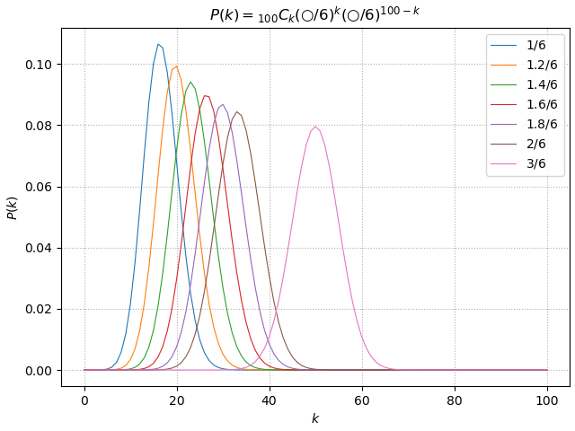

# 二項分布（binomial distribution）

成功確率 $p$ (失敗確率 $q=(1-p)$ )のベルヌーイ試行を $n$ 回試行したとき、 成功回数が従う分布を二項分布という。 $X\backsim B(n,p)$ で表す。横軸は $1\backsim n$ ではなく、**成功回数** である点に注意。縦軸は確率。

k 回成功する確率：

$X\backsim B(n,p)={}_nC_kp^k q^{n-k}$

～　具体例　～

サイコロを振って出た目が１なら成功、それ以外は失敗とする。この場合、成功確率 $1/6$ (失敗確率 $5/6$ )のベルヌーイ試行を $100$ 回試行したこととなる。

$P(k)={}_{100}C_k(1/6)^k(5/6)^{100-k}\quad※0\leqq k\leqq 100$

