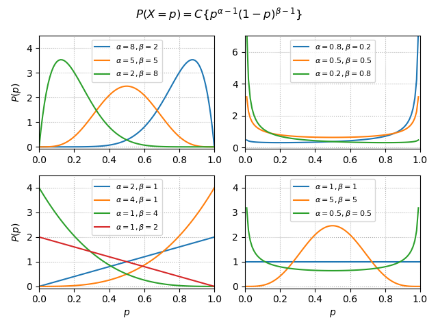
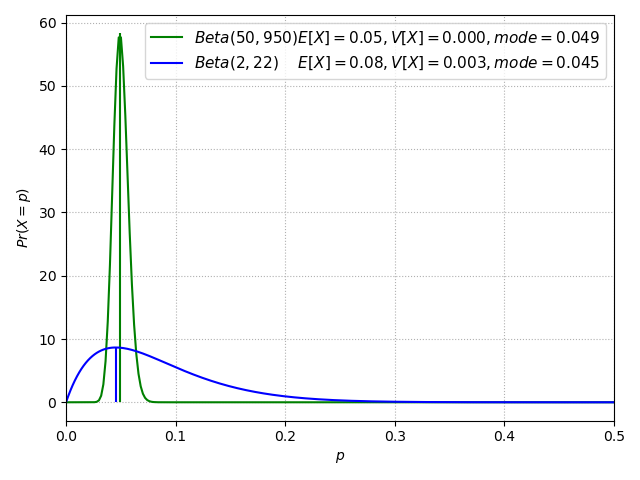
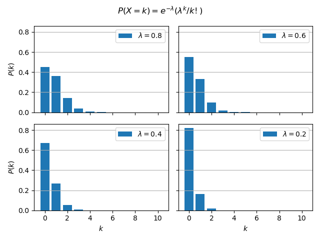

# ベータ分布
確率そのものを確率変数としたい場合に利用される。

確率密度関数：

$Pr(X=p)=Beta(\alpha,\beta)$

$\displaystyle=\frac{p^{\alpha-1}(1-p)^{\beta-1}}{B(\alpha,\beta)}=C\{p^{\alpha-1}(1-p)^{\beta-1}\}$

$\displaystyle B(\alpha,\beta)=\int^1_0 t^{\alpha-1}(1-t)^{\beta-1}dt$ （← ベータ関数という）

実現値 : $p\in[0,1]$

パラメータ : $\alpha,\space\beta$ 正の実数

※ $Beta(\alpha,\beta)$ を積分すると 1 になるように（**正規化条件**）、分母がベータ関数（定数C）となっている。

期待値：

$\displaystyle E[X]=\frac{\alpha}{\alpha+\beta}$

分散：

$\displaystyle V[X]=\frac{\alpha\beta}{(\alpha+\beta)^2(\alpha+\beta+1)}$

最頻値：

$\hat{p}=\displaystyle\frac{\alpha-1}{\alpha+\beta-2}$

～　グラフ　～

- $\alpha,\beta$ の大小関係によって最頻値を左右に振ることができる。
- $\alpha=\beta\lt 0$ で凹型にできる。
- $\alpha=\beta=1$ で一様分布にできる。

～　具体例　～
装置Aと装置Bから生産される部品の不良品数は各々次の通りであった。不良品の割合の期待値と最頻値を比較する。

【データ】  
装置A : 全体1000個。不良品50個  
装置B : 全体24個。不良品2個

期待値（平均） :  
装置A : 50/1000=5%◎  
装置B : 2/24=8%

最頻値 :  
装置A : (50-1)/(1000-2)=4.9%  
装置B : (2-1)/(24-2)=4.5%◎

期待値（平均値）からは装置Aの方が優秀と出る。一方、最頻値では装置Bの方が優秀と出る。
最頻値は、各装置の不良品の率として尤もらしい確率を示している。

# 二項分布（binomial distribution）

成功確率 $p$ (失敗確率 $q=(1-p)$ )のベルヌーイ試行を $n$ 回試行したとき、 確率変数（成功回数）が従う分布を二項分布という。 $X\backsim B(n,p)$ で表す。横軸は $1\backsim n$ ではなく、**成功回数** である点に注意。縦軸は確率。

k 回成功する確率分布 : $X\backsim B(n,p)$

$P(X=k)={}_nC_kp^k q^{n-k}$

期待値：

$E[X]=np$

分散：

$V[X]=npq$

～　具体例　～

サイコロを振って出た目が１なら成功、それ以外は失敗とする。この場合、成功確率 $1/6$ (失敗確率 $5/6$ )のベルヌーイ試行を $100$ 回試行したこととなる。

$P(k)={}_{100}C_k(1/6)^k(5/6)^{100-k}\quad※0\leqq k\leqq 100$

※ 二項分布は離散型の確率分布である（上記グラフでは連続型のようにみえるが）。

# ポアソン分布（Poisson distribution）

二項分布における期待値 $np=\lambda$ （＝平均）を固定し、成功確率 $p\to 0$ （試行回数 $n\to \infty$ ）と**極限をとった確率分布がポアソン分布。** $X\backsim Po(\lambda)$ で表す。

k 回発生する確率分布 :

$\displaystyle P(X=k)=e^{-\lambda}\frac{\lambda^k}{k!}$

---
【覚え方】

確率の総和は1なので、 $\displaystyle e^{-\lambda}\sum^{\infty}_{k=0}\frac{\lambda^k}{k!}=1$

$e^{\lambda}$ をマクローリン展開すると、 $e^{\lambda}=\displaystyle\sum^{\infty}_{k=0}\frac{\lambda^k}{k!}$ 

---

期待値：

$E[X]=np=\lambda$

分散：

$V[X]=np(1-p)=\lambda$

～　導出　～

二項分布から導く？

$\displaystyle P(X=k)={}_nC_kp^k q^{n-k}=\frac{n!}{k!(n-k)!}\Big(\frac{\lambda}{n}\Big)^k\Big(1-\frac{\lambda}n\Big)^{n-k}$

～　解説　～

ポアソン分布は、いくらでも細かく区切ることのできる時間や空間に分布する現象に対して用いられる。例えば、１時間を60分や60x60秒に分割できる現象、1平方メートルを100cmx100cmに分割できる現象がある。分割数を増やしていくと（ $n\to \infty$ ）、当然、その区間での事象の発生確率は小さくなっていく（ $p\to 0$ ）。これは $n$ を極大化、 $p$ を極小化した二項分布（ベルヌーイ試行）と理解することができる。

$X=X_1+X_2+...+X_n$

$X_i\backsim Be(\frac{\lambda}{n})$

$X\backsim B(n,\frac{\lambda}{n})\to Po(\lambda)$

$X\backsim Po(\lambda)$

但し、二項分布では、試行回数の分だけ確率変数=成功回数（横軸）の値は大きくなりうるが、ポアソン分布では、成功確率 $p\to 0$ のため、大きな値を取りうる確率はゼロに近いことが特徴である。

～　具体例　～

店舗に訪問してくるお客が、1時間当り、平均0.8人のポアソン分布に従う。 $e^{-0.8}=0.45$

$X\backsim P(0.8)$

$P(X=0)$ , $P(X=1)$ , $P(X>2)$ を求める。

$\displaystyle P(X=0)=e^{-0.8}\frac{0.8^0}{0!}=e^{-0.8}\Doteq{0.45}$

$\displaystyle P(X=1)=e^{-0.8}\frac{0.8^1}{1!}=0.8e^{-0.8}\Doteq{0.36}$

$\displaystyle P(X=2)=e^{-0.8}\frac{0.8^2}{2!}=0.32e^{-0.8}\Doteq{0.14}$

$P(X>2)=1-\{P(X=0)+P(X=1)+P(X=2)\}$  
$=1-e^{-0.8}(1+0.8+0.32)=1-1.44e^{-0.8}\Doteq{0.046}$

